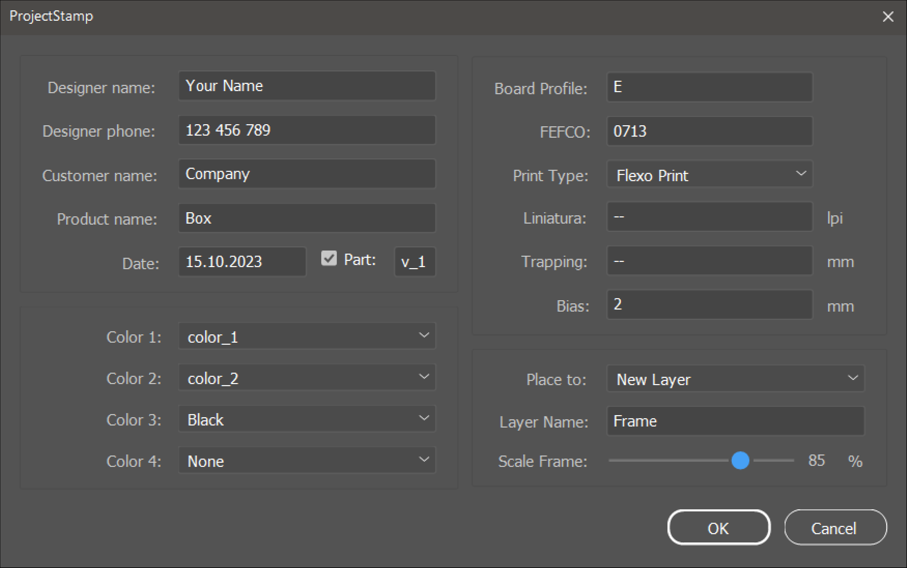
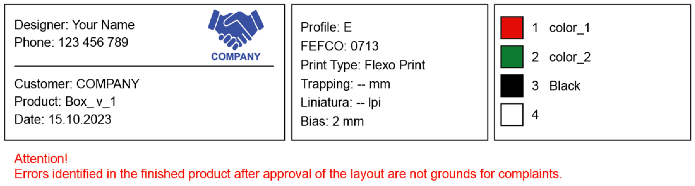

# ProjectStamp
Script for Adobe Illustrator.  
Adds a frame of project metadata entered into the form.

 
The script uses the file "Assets/Template.svg" as a template for positioning the entered information.  
The placement of elements inside the frame can be changed.  
Do not change the text of text elements, because the script searches for objects by their content.  

 
Permanent information can be specified in "Assets/DesignerProfile.txt".   
It will be automatically added to the form field.  

  
The list of available colors is compiled from the "Spot Color" project.

   
   

# Installation
You can run the script without installation right away by selecting the menu File → Scripts → Other Script, then Illustrator will ask you to specify the location of the file or drag the script file onto the Illustrator window with the mouse.

# Download
[Last releases](https://github.com/vgmove/project-stamp/archive/refs/heads/main.zip). 
